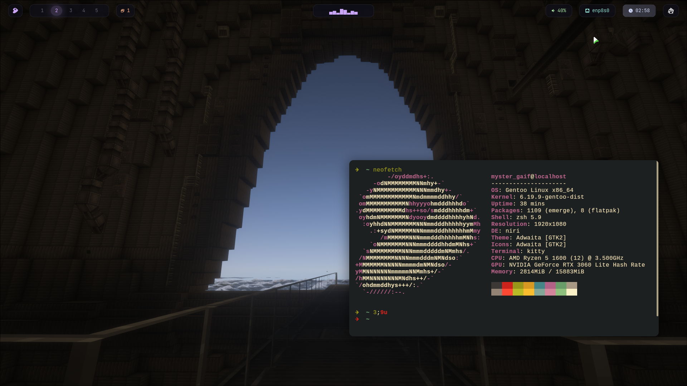
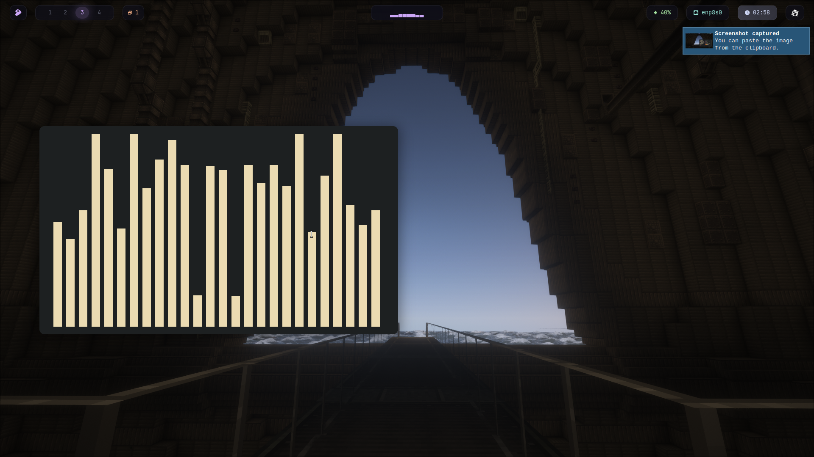
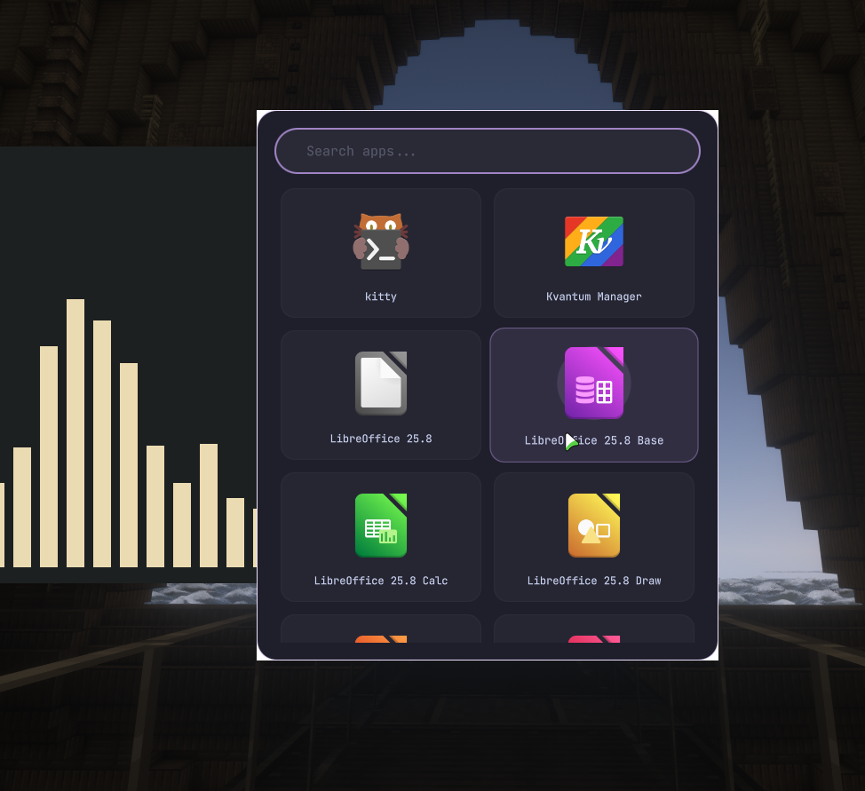
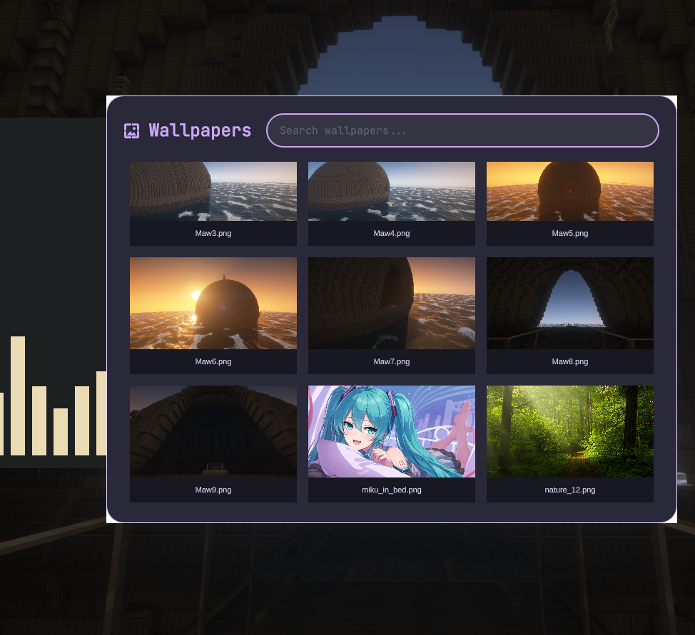
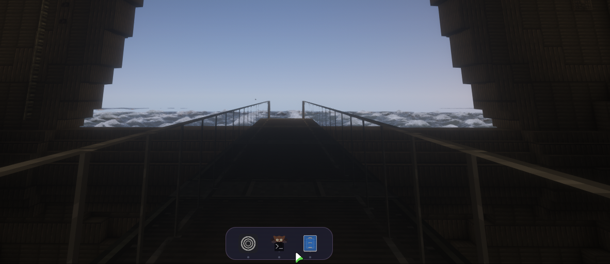

# InterNiri 🌌

A highly customized, aesthetic, and functional Wayland desktop environment powered by the **Niri** scrollable tiling compositor. This setup focuses on a seamless workflow using **Quickshell** for UI components and **Waybar** for status information.

---

## 📸 Screenshots

<p align="center">
  
</p>

---

<p align="center">
  
  
</p>

---

<p align="center">
  
  
</p>

---

## ✨ Key Features

* **Compositor:** [Niri](https://github.com/YaLTeR/niri) — A scrollable tiling Wayland compositor.
* **Dynamic UI:** [Quickshell](https://github.com/outfoxxed/quickshell) based app launcher, dock, and wallpaper picker.
* **Audio Visuals:** Integrated **Cava** support within Waybar via custom scripts.
* **Wallpaper Engine:** `swww` for smooth transitions and gif support.
* **Visual Flair:** 12px geometry corner radius, soft shadows, and Catppuccin-inspired borders.
* **Workflow:** Focused on keyboard-centric navigation with `Mod` (Super) key bindings.

## 🛠 Tech Stack

| Component | Software |
| :--- | :--- |
| **Shell / Panels** | Quickshell |
| **Status Bar** | Waybar |
| **Terminal** | Kitty |
| **Notification** | Dunst |
| **Launcher** | Rofi (Emoji) & Quickshell |
| **Browser** | Zen Browser |
| **File Manager** | Nautilus |

---

## 🚀 Installation

1.  **Clone the repository:**
    ```bash
    git clone [https://github.com/mystergaif/InterNiri.git](https://github.com/mystergaif/InterNiri.git)
    cd InterNiri
    ```

2.  **Copy configurations:**
    ```bash
    cp -r .config/* ~/.config/
    ```

3.  **Required Dependencies:**
    Make sure you have the following installed:
    `niri`, `quickshell`, `waybar`, `swww`, `kitty`, `dunst`, `rofi-wayland`, `grim`, `slurp`, `brightnessctl`, `pipewire`, `wireplumber`.

---

## ⌨️ Key Bindings (Highlights)

* `Mod + Return` — Open Terminal (Kitty)
* `Mod + D` — App Launcher
* `Mod + B` — Zen Browser
* `Mod + O` — Toggle Overview
* `Mod + V` — Toggle Floating Window
* `Mod + Shift + W` — Wallpaper Picker
* `Print` — Screenshot (Grim/Slurp)

---

## ⚖️ License & Author

**Author:** [mystergaif](https://github.com/mystergaif)

This project is licensed under the **GNU General Public License v3.0**.

```text
GNU GENERAL PUBLIC LICENSE
Version 3, 29 June 2007

Copyright (C) 2026 mystergaif

This program is free software: you can redistribute it and/or modify
it under the terms of the GNU General Public License as published by
the Free Software Foundation, either version 3 of the License, or
(at your option) any later version.
This program is distributed in the hope that it will be useful,
but WITHOUT ANY WARRANTY; without even the implied warranty of
MERCHANTABILITY or FITNESS FOR A PARTICULAR PURPOSE.  See the
GNU General Public License for more details.

You should have received a copy of the GNU General Public License
along with this program.  If not, see <https://www.gnu.org/licenses/>.
